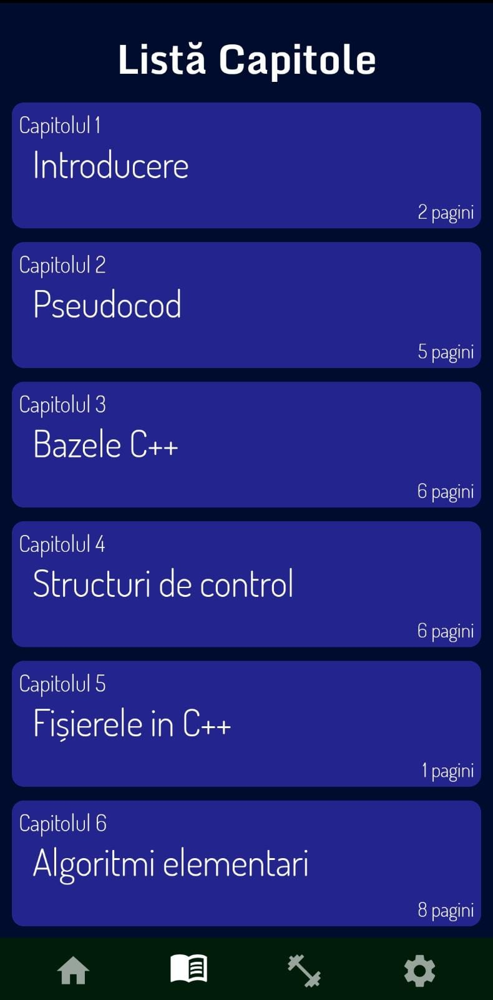

# Informatica Bac App

Application built in Android Studio with Java, HTML/CSS and XAML programming languages.  
It is built around the Romanian baccalaureate exam. It teaches you the basics of the C++ programming language.  
In addition to the structured theory chapters, the application also contains a quiz in which students can practice for  
the final exam. The subjects from past years could not be missing, which can be viewed directly in the application with the help of an implemented PDF viewer.  
These days, you have to implement more themes in your application, so 2 themes are available, light and dark. 

  
  
  

  
  
  

